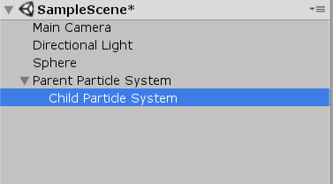
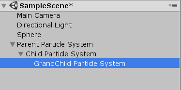

# 파티클 재생은 자식까지 된다

유니티로 파티클을 사용할 일이 굉장히 많은데<br/>
이번에 새로운 사실을 알게 되었다.<br/>
파티클을 재생시키면 하이어러키 자식에 있는 파티클도 같이 재생이 된다는 것이다.<br/>

<br/>
<br/>  

## 하이어러키 구조 예시  



대충 요런 느낌으로 파티클이 있다고 하면<br/>
부모 파티클을 재생시키면 자식 파티클도 같이 재생이 된다.<br/>  

에디터에서 부모 파티클을 선택하고 재생을 했을 때 자식 파티클도 같이 재생되긴 했지만<br/>
스크립트에서는 당연히 따로 재생을 시켜주어야 하는지 알았다.<br/>
그런데 위와 같이 구조가 짜여져 있으면<br/>
그냥 부모 파티클만 재생시켜도 자식 파티클을 알아서 재생이 된다.<br/>
<br/>
그런데 이 상태에서 부모 파티클만 재생시키고 싶을 수도 있지 않을까?<br/>
이미 해당 기능이 만들어져있다.<br/>
```
particle.Play(); // 자식까지 같이 재생

particle.Play(false); // 부모만 재생
```
플레이 함수가 오버로딩 되어있어서<br/>
이걸 잘 활용하면 된다.<br/>
<br/>

### 그러면 손자는?


자식이 되면 손자는 될까?<br/>
위와 같은 구조를 만들고 간단히 테스트를 해봤다.<br/>
그랬더니 손자도 같이 재생되는 것을 볼 수 있었다.<br/>
<br/>
여러개의 파티클을 한번에 재생을 해야할때 사용하면 굉장히 편리할 것 같다.

### 잡담
```
이렇게 구조를 짜본적도 없고
하나의 상황에 하나의 파티클을 재생시키던가
여러개의 파티클을 따로 엮어서 재생을 시켰던 것 같은데

이런 식으로 편리하게 사용할 수 있다는 사실에 놀랐음
무엇보다 ParticleSystem.Play() 이걸 굉장히 자주 사용했던 것 같은데
이걸 사용하면 밑에 오버로딩이 떠서 손쉽게 알 수 있었던 정보였던 것 같은데
이제까지 이걸 발견하지 못한 것도 신기했음

아무튼 이걸 알게되니깐 약간 모르면 손해보는 정보 같았고
모르는 상태에서 파티클 만지작 거리다가 저런식으로 구조를 만들어서 플레이 시키면
자칫 잘못하다가 삽질을 할 수도 있지 않았을까 하는 생각도 들었음

근데 또 뭔가 작성을 하다보니깐 예전에 알고 있었던 정보 같기도 하고
뭔가 똑같이 신기해 했던 것 같기도 하고
뭔가 똑같이 정리를 해놓아야겠다 생각한 것 같기도 한데
뭔가 기억이 잘 안남

아무튼 여러모로 신기했던 정보였음
```